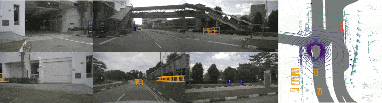
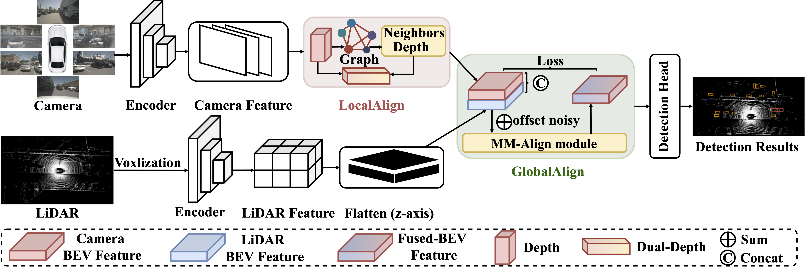

<div align="center">   

  # GraphBEV: Towards Robust BEV Feature Alignment via Graph Matching for Multi-Modal 3D Object Detection
</div>

<div align="center">
  
</div>

This is the official repository of **GraphBEV**. GraphBEV is designed to address the feature misalignment issue in previous BEV-based methods in real-world scenarios. In order to solve the problem of local misalignment, the **LocalAlign** module is introduced to obtain adjacent depth information through graphics, combined with explicit depth supervision from LiDAR to the camera. Then, the **GlobalAlign** module is proposed to encode the supervised depth and adjacent depth from LiDAR to the camera through dual depth encoding to generate a new reliable depth representation. Additionally, global misalignment issues are resolved by dynamically generating offsets. GraphBEV significantly outperforms BEVFusion on the nuScenes validation set, particularly in the presence of **noisy misalignment**.

------

:fire: Contributions:
* We propose a robust fusion framework, named GraphBEV, to address feature misalignment arising from projection errors between LiDAR and camera inputs.
* By deeply analyzing the fundamental causes of feature misalignment, we propose LocalAlign and GlobalAlign modules within our GraphBEV to address local misalignments from imprecise depth and global misalignments between LiDAR and camera BEV features.
* Extensive experiments validate the effectiveness of our GraphBEV, demonstrating competitive performance on nuScenes. Notably, GraphBEV maintains comparable performance across both clean settings and misaligned noisy conditions.

# Abstract
Bird's-Eye-View (BEV) fusion methods have made remarkable progress in recent years. However, their performance is susceptible to misalignment between LiDAR and camera BEV, caused by inaccurate calibration relations due to real-world factors such as road bumps. In this work, we propose a robust 3D detector, named GraphBEV, which employs neighbor-aware depth features via Graph matching to align BEV features accurately. We construct pixel nearest neighbors using a Graph to obtain supervised depth neighbor information to address errors in explicit depth supervision. Subsequently, we simulate the offset noise of LiDAR and camera BEV features, followed by aligning global multi-modal features through learnable offsets. **Our GraphBEV achieves state-of-the-art performance on nuScenes, attaining 70.1\%  mAP to surpass BEVFusion by 1.6\%  on the validation set. It also reaches 69.1\%  mAP on the misalignment noisy settings, exceeding BEVFusion by 8.3\%** .

# Method
<div align="center">
  
</div>

An overview of GraphBEV framework. The LiDAR branch almost follows the baselines (BEVfusion-MIT, TransFusion) to generate LiDAR BEV features. In the camera branch, first, we extract camera BEV features using proposed LocalAlign module that aim to addressing local misalignment due sensor calibration errors. Subsequently, we simulate the offset noisy of LiDAR and camera BEV features, followed by aligning global multi-modal features through learnable offsets. It is noteworthy that we only add offset noise to the GlobalAlign module during training to simulate global misalignment issues. Finally, we employ a dense detection head (TransFusion) to accomplish the 3D detection task.

# Model Zoo

* Results on nuScenes **val set**.

| Method | Modality | NDS⬆️ | mAP⬆️ | m BEV Map Seg.⬆️ | Config |
| :---: | :---: | :---: | :---: | :---: | :---: |
| BEVfusion-MIT | LC | 71.4 | 68.5 | 62.7 | [config](tools/cfgs/nuscenes_models/bevfusion_graph.yaml) |
| GraphBEV | LC | 72.9 | 70.1 | 63.3 | [config](tools/cfgs/nuscenes_models/bevfusion_graph_deformable.yaml) |

* Results on nuScenes **test set**.

| Method | Modality | NDS⬆️| mAP⬆️ |
| :---: | :---: | :---: | :---: |
| BEVfusion-MIT | LC | 72.9 | 70.2 |
| GraphBEV | LC | 73.6 | 71.7 |

* Results on nuScenes validation set under **noisy misalignment** setting.

| Method | Modality | NDS⬆️| mAP⬆️ | LT(ms)⬇️ |
| :---: | :---: | :---: | :---: | :---: |
| BEVfusion-MIT | LC | 65.7 | 60.8 | 132.9 |
| TransFusion | LC | 70.6 | 66.4 | 164.6 |
| GraphBEV | LC | 72.0 | 69.1 | 141.0 |

# How to introduce misalignment noise into GraphBEV

GraphBEV is robust under various weather conditions. If you want to introduce misalignment noise into GraphBEV, please modify the following settings in [config](tools/cfgs/nuscenes_models/bevfusion_graph_deformable.yaml):
```
MODEL:
    ...
    VTRANSFORM:
        ...
        Noise: False
        K_graph: 25
...
```
Noisy Misalignment will be introduced when **Noise** is True, and **K_graph** represents the number of neighbor depths.

Whether Noisy Misalignment is introduced will be judged by the following [code](pcdet/models/view_transforms/depth_lss.py) :
```python
...
if not self.training:#test
    if self.noise:
        print("spatial_alignment_noise")
        lidar2image=self.spatial_alignment_noise(lidar2image,5)
        camera2lidar=self.spatial_alignment_noise(camera2lidar,5)
    else:
        print("clean")
...
```

Function **spatial_alignment_noise** is as following [code](pcdet/models/view_transforms/depth_lss.py) :
```python
def spatial_alignment_noise(self, ori_pose, severity):
    '''
    input: ori_pose 4*4
    output: noise_pose 4*4
    '''
    ct = [0.02, 0.04, 0.06, 0.08, 0.10][severity-1]*2
    cr = [0.002, 0.004, 0.006, 0.008, 0.10][severity-1]*2
    r_noise = torch.randn((3, 3), device=ori_pose.device)* cr
    t_noise = torch.randn((3), device=ori_pose.device) * ct
    ori_pose[..., :3, :3] += r_noise
    ori_pose[..., :3, 3]+= t_noise
    return ori_pose
```

# Train and Inference

* Training is conducted on 8 NVIDIA GeForce RTX 3090 24G GPUs. 
```bash
CUDA_VISIBLE_DEVICES=0,1,2,3,4,5,6,7 python -m torch.distributed.launch --nproc_per_node=8 --master_port 29535  train.py --launcher pytorch --batch_size 24  --extra_tag bevfusion_graph_deformable_result_scenes_K_graph8 --cfg_file cfgs/nuscenes_models/bevfusion_graph_deformable.yaml  --save_to_file 
```

* During inference, we remove Test Time Augmentation (TTA) data augmentation, and the batch size is set to 1 on an A100 GPU.
```bash
CUDA_VISIBLE_DEVICES=0 python -m torch.distributed.launch --nproc_per_node=1 --master_port 29541 test.py --launcher pytorch --batch_size 1 --extra_tag bevfusion_graph_result_scenes_K_graph8 --cfg_file cfgs/nuscenes_models/bevfusion_graph.yaml --start_epoch 1 --eval_all --save_to_file --ckpt_dir ../output/nuscenes_models/bevfusion_graph/bevfusion_graph_result_scenes_K_graph8/ckpt
```

* All latency measurements are taken on the same workstation with an A100 GPU.

# Acknowledgement
Many thanks to these excellent open source projects:
- [BEVFusion-MIT](https://github.com/mit-han-lab/bevfusion) 
- [mmdet3d](https://github.com/open-mmlab/mmdetection3d)
- [OpenPCDet](https://github.com/open-mmlab/OpenPCDet)
- [TransFusion](https://github.com/XuyangBai/TransFusion/) 
